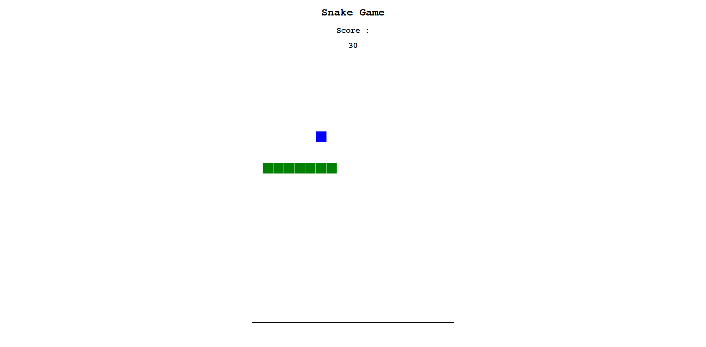

## How to Play

- **Objective**: Control the snake to eat blue apples, which increases your score and makes the snake longer. Avoid colliding with the snake’s own body.
- **Controls**:
- **Arrow Keys**:
 - **Left Arrow**: Move snake left.
 - **Up Arrow**: Move snake up.
 - **Right Arrow**: Move snake right.
 - **Down Arrow**: Move snake down.
- The snake cannot reverse direction (e.g., cannot move left if already moving right).
- **Gameplay**:
- The snake moves on a 19x25 grid (608x800 pixels).
- Each apple eaten adds 10 points to your score and increases the snake’s length.
- The snake wraps around the edges of the canvas (e.g., moving off the left edge reappears on the right).
- Colliding with the snake’s own body resets the game, setting the score to 0 and restarting the snake.
- **Score**: Displayed above the canvas, updated in real-time as you eat apples.

## Screenshot

Below is a screenshot of the Snake game in action:

## Notes

- The snake moves at a fixed speed (updated every 8 frames for a slower pace).
- The apple spawns at random grid-aligned positions, ensuring it aligns with the snake’s movement grid.
- To adjust the snake’s speed, modify the `count < 8` threshold in `snake_game.js` (higher values slow the snake further).
- Ensure your browser’s developer console (F12) is open to check for errors if the game doesn’t run as expected.

## Troubleshooting

- **Canvas Not Displaying**: Ensure `index.html` references `snake_game.js` correctly and that the `<canvas id="game">` element is present.
- **Apple Not Detected**: The snake and apple are grid-aligned, so collisions should be reliable. If issues persist, check the console for coordinate mismatches.
- **Performance**: If the game feels laggy, try a different browser or reduce the canvas size by adjusting `columnCount` and `rowCount` in `snake_game.js`.